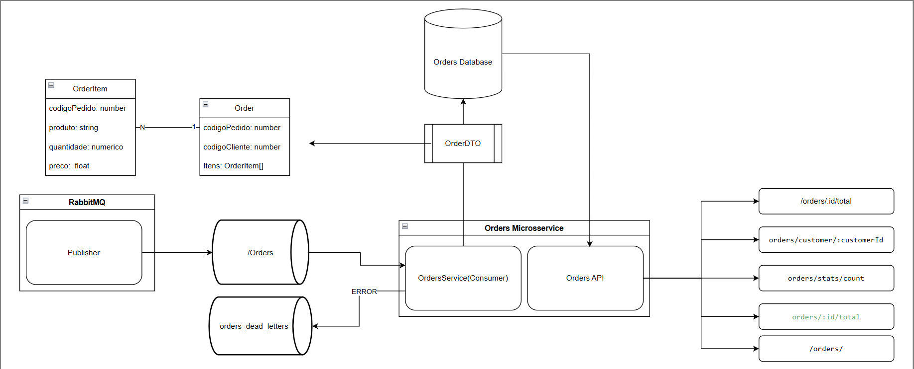

# Plano de Trabalho – Desafio Hertz

> Versão 1.1 – _última atualização: **08/05/2025**_

---

## 1. Visão Geral
O objetivo deste desafio é criar uma solução capaz de:
1. Consumir mensagens de pedidos a partir de uma fila RabbitMQ.
2. Persistir os pedidos em um banco MySQL.
3. Disponibilizar uma API REST para consulta de:
   - Valor total do pedido.  
   - Quantidade de pedidos por cliente.  
   - Lista de pedidos realizados por cliente.  

A entrega deve ser **dockerizada**, devidamente **testada** e acompanhada de **relatório técnico**.

---

## 2. Escopo Funcional
| Requisito | Entregável | Status |
|-----------|-----------|---|
| Consumidor RabbitMQ | Serviço Node/TS em `src/queue` | ✅ |
| Persistência MySQL | Tabelas `orders` e `order_item` via TypeORM migrations | ✅ |
| API REST | Rotas `/orders/:id/total`, `/orders/customer/:customerId`, `/orders/stats/count` | ✅ |
| Dockerização | `Dockerfile` + `docker-compose.yml` (app + db + rabbit) | ✅ |
| Testes | Unitários e integração (Jest) | ☐ _em andamento_ |
| Documentação | README + Plano de Trabalho + Diagramas | ✅|

---

## 3. Macro-Cronograma (7 dias)

| Dia | Atividade | Artefatos                            |
|-----|-----------|--------------------------------------|
| 1 | Levantamento do escopo, criação do repositório | README inicial, Plano de Trabalho v1 |
| 2 | Modelagem ER + migrations | `src/migrations`                     |
| 3 | Implementação do consumidor RabbitMQ | `src/services/OrderService.ts`       |
| 4 | Implementação da API REST | `src/controllers`, `src/routes`      |
| 5 | Dockerização completa | `Dockerfile`, `docker-compose.yml`   |
| 6 | Testes unitários/integração | `tests/`                             |
| 7 | Ajustes finais, documentação e evidências | Relatório técnico, imagens Docker    |

---

## 4. Arquitetura de Solução

- [Versão em PDF](./arquitetura.pdf)

---

## 5. Tecnologias Utilizadas

| Tecnologia | Versão | Finalidade |
|------------|--------|------------|
| TypeScript | 5.5.3 | Linguagem de programação com tipagem estática |
| Node.js | 18.x | Plataforma de execução JavaScript |
| Express | 5.1.0 | Framework web para construção da API REST |
| TypeORM | 0.3.22 | ORM para manipulação do banco de dados |
| MySQL | 8.0 | Sistema de banco de dados relacional |
| RabbitMQ | 3.12 | Message broker para filas de mensagens |
| amqplib | 0.10.3 | Cliente para conexão com RabbitMQ |
| Docker | 24.x | Plataforma para containerização da aplicação |

---
## 6. Desvios 
### 1. Abordagem inicial
Ao começar o desafio, baseei-me na minha “memória muscular” e, ao ler rapidamente o enunciado, foquei na parte que pedia “crie uma API REST” e no objeto _Order_. Naturalmente, projetei o sistema como um CRUD tradicional, definindo relacionamentos entre _Customer_, _Order_ e _OrderItem_, e implementei toda a estrutura inicial do projeto (entidades, repositórios, controllers e rotas).

### 2. Redefinição de escopo
Alguns dias depois, ao revisar o enunciado com mais atenção, percebi que o requisito principal era, na verdade,:
- Criar um microsserviço que consumisse dados de uma fila RabbitMQ e gravasse informações para permitir:  
  - Cálculo do valor total do pedido  
  - Quantidade de pedidos por cliente  
  - Listagem de pedidos por cliente  

Ao entender que se tratava de um microsserviço orientado a processamento de mensagens, ficou claro que não havia necessidade de expor endpoints REST para inserção ou consulta de clientes, tampouco de manter tabelas específicas para essas operações. O serviço deveria simplesmente receber mensagens, persistir os dados de pedidos e gerar as métricas solicitadas.

### 3. Impacto na escolha da stack
Se eu tivesse me atentado ao escopo de microsserviço desde o início, teria optado por uma solução baseada em banco de dados NoSQL (por exemplo, MongoDB), devido à sua flexibilidade para armazenar os dados recebidos da fila e consultar rapidamente os agregados de pedidos, sem a necessidade de esquemas rígidos de tabelas relacionais.

## Repositórios

[Desafio 1](https://github.com/Alysson-Alves23/Projeto-1)
[Desafio 2](https://github.com/Alysson-Alves23/Projeto-2)

## 8. Perfis

